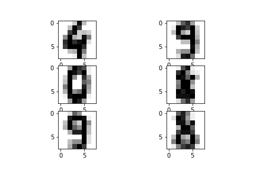
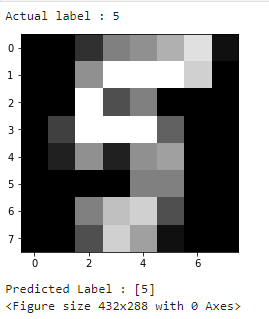

# Project Description
This notebook uses the famoust Handwritten dataset from UCI ML repository to train a model predcting hand written digits.

# Recognizing Handwritten Digits
Recognizing handwritten text is a problem that can be traced back to the first automatic
machines that needed to recognize individual characters in handwritten documents.
Think about, for example, the ZIP codes on letters at the post office and the automation
needed to recognize these five digits. Perfect recognition of these codes is necessary in
order to sort mail automatically and efficiently.

# Dataset used
Dataset is take from famous [UCI Machine Learning repository] (http://archive.ics.uci.edu/ml/datasets/Optical+Recognition+of+Handwritten+Digits)

# Requirements
* numpy
* matplotlib
* sklearn
* pandas
* jupyter notebook

## Algorithm used
SVM (Support Vector Machine)

# Learning and Predicting 
Once you define a predictive model, you must instruct it
with a training set, which is a set of data in which you already know the belonging class.
Given the large quantity of elements contained in the Digits dataset, you will certainly
obtain a very effective model, i.e., one that’s capable of recognizing with good certainty
the handwritten number.This dataset contains 1,797 elements, and so you can consider the first 1,791 as a
training set and will use the last six as a validation set.

## Last 6 digits that we will predict

## Our Prediction
 array([4, 9, 0, 8, 9])

# Prediction using train_test_split

we get correct answer with simplest model…!!! you can also try with other samples
